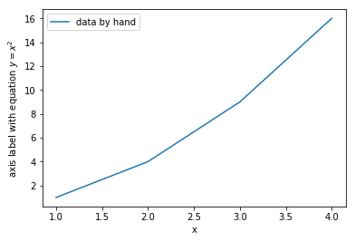
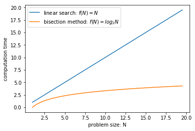

# CPSC128
This is a repository for the CPSCS 128 "Introduction to Programming using Python" course.

See the syllabus: [CPSC 128 Spring 2018-19 Syllabus](files/CPSC_128_outline_2019.pdf)

## Table of Contents

* [Announcements](#announcements)
* [Assignments](#assignments)
* [Slides](#slides)
* [Lecture Notes](#lecture-notes)
* [Python Resources](#online-python-resources)
* [Outline](#outline)
* [git cheats](#git-cheatsheet)
* [python cheats](#python-cheatsheet)
* [computing setup](#computing-setup)
* [github markdown](#github-markdown)
* [vim cheats](#vim-cheats)


## Announcements

Please make sure to subscribe to 'Announcements' issue so that you get notified. 

[https://github.com/Sinan81/cpsc128/issues/4]

* Jun 01, Sat, May 28 class slides posted
* May 29, Wed, More lecture notes are posted
* May 25, Sat, Assignment #3 is posted.
* May 24, Fri, Slides for May 21 and 23 classes are posted.
* May 23, Thu, Assignment1's are marked.
* May 18, Sat, python cheatsheet is improved (see below)
* May 17, Fri, Assignment #2 is posted.

## Lecture Notes (by Tim Topper)
In this course, to a significant extent I will be following previous instructor's (Tim Topper) contents. Accordingly, you might find his lecture notes useful:

[Lecture Notes](files/lecture_notes_cpsc128/)

After cloning this repository to your computer open the following file on an internet browser: `files/lecture_notes_cpsc128/index.html`

## Assignments

[Assignment 1](assignment1.md) Due May 20, Monday

[Assignment 2](assignment2.ipynb) Due May 24, Friday

[Assignment 3](assignment3.md) Due Jun 3rd, Monday

## Outline

0. Course start-up.
* Part I: Procedural programming
1. Introduction to computer science.
2. SIPO (sequence, input, processing and output) programming.
3. Selection control structures.
4. Repetition control structures.
* Part II: Object-based programming
5. Aggregate data types 1: Lists and strings.
6. Functions.
7. Aggregate data types 2: Dictionaries.
8. Text files.
* Part III: Object-oriented programming
9. Object-oriented programming (OOP) 1: Encapsulation.
10. Object-oriented design (OOD).
11. Object-oriented programming (OOP) 2: Polymorphism and inheritance.
12. TBA
* Final Examination

## Online Python Resources
You might want to check out the following online resources:

* [Official Python Tutorial](https://docs.python.org/3.6/tutorial/)
* [Think Python: How to Think Like a Computer Scientist](http://greenteapress.com/thinkpython/html/index.html)
* [Learn Python The Hard Way](https://learnpythonthehardway.org/book/index.html)
* [Hand-On Python: A Tutorial Introduction for Beginners](http://anh.cs.luc.edu//python/hands-on/handsonHtml/handson.html)

## Slides

[May  2](files/cpsc128_slides_may2.pdf)

[May  7](files/cpsc128_slides_may7.pdf)

[May  9](files/cpsc128_slides_may9.pdf)

[May 14](files/cpsc128_slides_may14.pdf)

[May 16](files/cpsc128_slides_may16.pdf)

[May 21](files/cpsc128_slides_may21.pdf)

[May 23](files/cpsc128_slides_may23.pdf)

[May 28](files/cpsc128_slides_may28.pdf)

## git cheatsheet

If created new file, first tell `git` to track it
```
git add mycode.py
```

If a new file added or a current file is modified, save it via
```
git commit -m 'commit message' mycode.py
```

Push modifications in local repo to the remote git server (github)
```
git push
```

To download github repository:

```
git clone https://github.com/Sinan81/cpsc128.git
```

Already downloaded a repo, but want to pull updates to it?. First navigate to the repository folder on git-bash console and do a pull:
```
cd ~/cpsc128
git pull
```

## python cheatsheet

- get help via `help()`

- get input from user
```python
# get integer, float, .. input
inval = eval(input("Enter an integer")) 
# string input
inval = input("Enter a string input")
```
- divison (Python3)
```python
#integer division: yields integer, discards decimal places
9//5

#float division
9/5
```

- print statement
```python
# syntax print a list of stuff separated by ', '
print(list)

# example
s='world'
print("hello ", s, '!', 5+7)

#hold the current output line open (as opposed to going to the next line)
print("Hello", end='')
```
- import a module/library and use a method from this module:

```python
import math
math.sqrt(9)

import math as m
m.sqrt(9)

from math import sqrt
sqrt(9)

from math import *
sqrt(9)
```
- selection using if
```python
# example 1
if x < 0:
    print("x is negative")

# example 2
if flip == 1:
    print("Head")
else:
    print("Tail")

# example 3
if num < 0:
    print("num is negative")
elif num == 0:
    print("num is zero")
else:
    print("num is positive")
```
- relational & logical operators

| operator | explanation |
| --- | --- |
| < | less than |
| <= | less than or equal to |
| == | equal to |
| != | not equal to |  
| >= | greater than or equal to |
| >  | greater than |
| a and b | `True` if both a & b are true |
| a or b  | `True` if either a or b are True |
| not a   | negation operator: e.q. **not** True -> False |

- use `random` module to generate random numbers
```python
from random import randomint random
randomint(1,100) # generates a random integer between 1 and 100
random() # generates a random float betwee 0. and 1.0 inclusive
```
- repetition with `while`
```python
# syntax is
while test:
    statement
```
Basic usage
```python
x=1 #initialize
while x < 1:
    print(x)
    x = x+1
```
Input validation
```python
num = input( "Enter a number between 1 and 100: " )
while num < 1 or num > 100:
    print("Oops, your input value (", num, ") is out of range.")
    num = input( "Be sure to enter a value between 1 and 100: " )
```
Repeating a program
```python
again = "y"
while again == "y" or again == "Y" or again == "yes" or again == "Yes":
    #
    # Put the body of your program here
    #
    again = input( "Play again (y/n)? " )
print("Thanks for playing")
```
- working with lists

See `help(list)` or `dir(list)` for all list atrributes and methods.

```python
#create list
mylist = list(range(10))               
mylist = [19, 'a', 3.14, 'Tea']

#check if an item exists in mylist using **in** construct 
19 in mylist                   

#access individual items in a list 
mylist[0]                       #0th item
mylist[1]                       #1st item                        
mylist[-1]                      #the last item
mylist[1:4]                     #get a slice of list (items 1,2, and 3) 

len(mylist)                     #number of items in list 
del(mylist[2])                  #delete item by index 
mylist = mylist + ['bye']       #concatenate two lists 
2*mylist                        #concatenate mylist twice.   

mylist.append(2)                #append item to the list 
mylist.insert(1,'hi')           #insert 'hi' before index 1  
mylist.remove('a')              #delete item by value 
mylist.pop()                    #delete the last item in the list 
mylist.index('Tea')             #returns position of item 'Tea' 
mylist.count('bye')             #counts number of 'bye's in the list 
mylist.sort()                   #sort the list 
mylist.reverse()                #reverse the order of the list 
mylist.extend()                 #extend list by appending items from an **iterable**
```

- working with strings

See `help(str)` or `dir(str)` for all str atrributes and methods.

```python

s = 'Hello World'               #create string
s = ''.join(alist)              #create string from a list

# access
s[0]                            #get 0th element
s[1]                            #get 1st element
s[-1]                           #get the last element
s[1:4]                          #get a slice of string (characters 1,2, and 3)

# add
s = s + 'a word'                #concatenate
2*s                             #concatenate s twice. 

# info about a string
len(s)                          #returns the length of string
s.find('Tea')                   #returns position where first occurance of 'Tea' begins
s.count('o')                    #counts number of 'o's in the string
'l' in s                        #test if a substring is contained in a longer string

# misc. str methods
s[2].isalpha()                  #check if s[2] is alphabetical, i.e A-Z
'867-395-0892'.split('-')       #split the string into words assuming '-' is the seperator (delimeter)  
s.lower()                       #convert to lowercase
s[1].isupper()                  #check if s[1] is uppercase
```

- basic plotting

A simple example where data is entered by hand: x=[1,2,3,4], y=[1,4,9,16].
```python
import matplotlib.pyplot as plt
plt.plot([1,2,3,4], [1,4,9,16], label='data by hand')
plt.ylabel('axis label with equation $y=x^2$')
plt.xlabel('x')
plt.legend()
plt.show()
```


Plotting a function
```python
import numpy as np
import matplotlib.pyplot as plt

#generate a list of x values to be fed to a function
#[1., 1.5, 2, 2.5 ...]
N = np.arange(1,20,0.5) 

plt.plot(N, N, label='linear search: $f(N)=N$')
plt.plot(N, np.log2(N), label='bisection method: $f(N)=log_2N$')

plt.ylabel('computation time')
plt.xlabel('problem size: N')
plt.legend()
plt.show()
```
yielding



- timing code

```python
import time as tm
begin = tm.time()

#
# block of code to be timed
#

end = tm.time()
print('That took', end-begin, 'seconds')
```
- Python-3 vs Python-2

| code		| Python3			| Python2			|
----------- | ----------------- | ----------------- |
| `9/5`		| float division	| integer division	|
| `9//5`	| integer division	| float division	|
| `range(10)` | yields a range object do `list(range(10))` to obtain a list	|	yields a list	|
| `input()`	| raw_input()		| smart input, like `eval(input())` |
| `print("Hello")` | print				| -	|
| `print "Hello"`	| -			| print	|

## github Markdown

If you want to create nice looking pages on github (such as README.md), you might want to checkout the following links for examples of Markdown (.md) language:

* https://guides.github.com/features/mastering-markdown/
* https://github.com/adam-p/markdown-here/wiki/Markdown-Cheatsheet

## vim cheats

* hit 'i' to edit
* hit 'Esc' to escape edit mode
* do `:w` to save
* do `:q` to quit
* do `:wq` to save and quit
* hit '/' to do a search, and 'Esc' to get back to normal mode
* do 'p' to paste before, 'P' to paste after
* hit 'v' to switch to visual mode to select stuff for cutting, copying etc.

## Computing Setup

* python3
* git: version control
* github account
* spyder (optional): Integrated development environment (IDE) for Python
* jupyter (optional)


